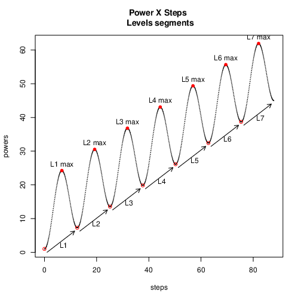
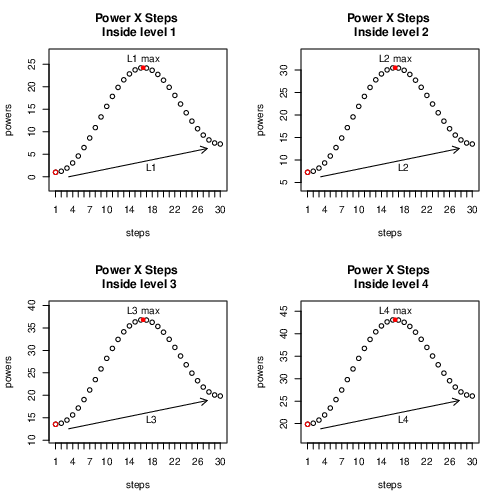
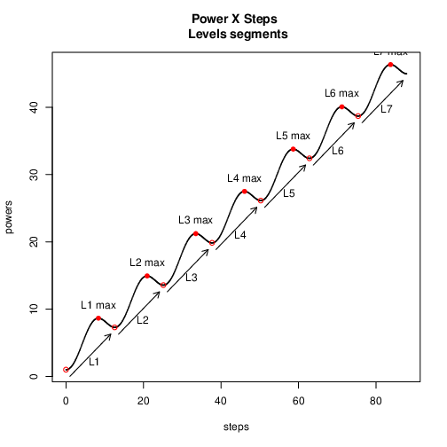

# Level Power

Creates a difficult progression, organized in levels.

# Use

Create a list of powers

```ruby
level = 2
steps = 30
power = { angular: 0.5, amp: 5, freq: 0.5 }

level_power = LevelPower.new(level: level, steps: steps, power: power)

puts level_power.powers
```

<details>
  <summary>Output: </summary>

```
7.283185307179586
7.391767582316637
7.718866714025351
8.259340412254007
8.998720894509198
9.913847197374924
10.973877421752462
12.14163667184689
13.375241776498237
14.629931784738904
15.860024234137871
17.020911693617677
18.07101132224272
18.973582238904722
19.698331275129515
20.22273693190209
20.533033677243676
20.624813566013604
20.503218888263586
20.182717426487034
19.686470144099953
19.04531894020105
18.29643871058526
17.481712626412563
16.64590163865053
15.834688209730196
15.092679770729028
14.461459162582626
13.977767266399262
13.671897250653107
13.566370614359172
```

</details>

Just a formatted output:

```ruby
puts "Level #{level} - Step: Power"
level_power.powers.each_with_index do |power, step|
  puts "#{step}:\t#{power.round(1)}"

  # bang bang bang bang!
end
```

<details>
  <summary>Output: </summary>
 
 ```
 Level 2
Step: 	Power
0:	7.3
1:	7.4
2:	7.7
3:	8.3
4:	9.0
5:	9.9
6:	11.0
7:	12.1
8:	13.4
9:	14.6
10:	15.9
11:	17.0
12:	18.1
13:	19.0
14:	19.7
15:	20.2
16:	20.5
17:	20.6
18:	20.5
19:	20.2
20:	19.7
21:	19.0
22:	18.3
23:	17.5
24:	16.6
25:	15.8
26:	15.1
27:	14.5
28:	14.0
29:	13.7
30:	13.6
 ```
 
</details>
 
# Parameters

* level: which level to generate, starting from 1 
* steps: how many power steps (size) to generate
* power:
	* angular: controls the slope of the base line. Note: actually the *tan(angle)*
	* amp: controls the amplitude of the base oscillation.
	* freq: controls the frequency of oscillation.  
 
# Charts

> Note: You can create these charts with the R version of the lib.

## The progression of levels will be like this chart.



Using: Level=1, angular=0.5, amp=10 and freq=0.5

## A level comparison chart
 


Using: Level=1, angular=0.5, amp=10 and freq=0.5

## Chart comparison

<table>
<tr>
<td>

 

</td>

<td>


</td>

</tr>
</table>

Frequency change effect


<table>
<tr>
<td>


</td>

<td>

 

</td>

</tr>
</table>

Amplitude change effect.

> Note: Attention to the changes in the *values* in the axes. Frequency changes the "x" distance between levels. Amplitude changes de "y" distance (max) inside a level.

---

> Note: The R version is a draft, used in experiments. May be removed in the future. 
